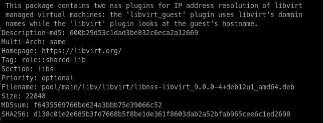

# prueba_javi
Repositorio de prueba 2ASIR

---

# Ejercicio Markdown

---

# Título principal
## Subtítulo

Esto es un párrafo de texto con palabras en **negrita**, otras palabras en *cursiva* y alguna palabra en 'código'.

```bash
git clone URL
```

1. Lista
2. Ordenada
3. De
4. Varios
5. Elementos

+ Lista
+ Desordenada
+ De
+ Varios
+ Elementos

[Enlace a mi GitHub](http://www.github.com/fjhuete)


| Título | De | Tabla |
|---|---|---|
|Campo1 | Campo2 | |
